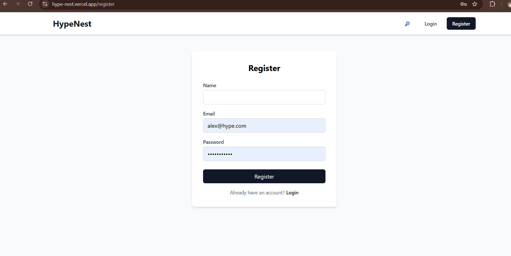
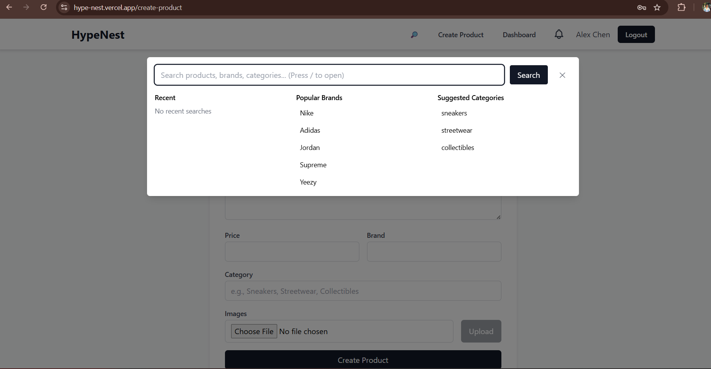
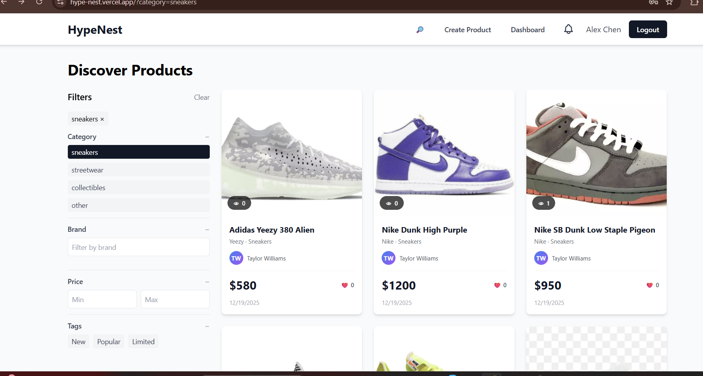

# 🔥 HypeNest - Premium Marketplace Platform

[](https://nodejs.org/)
[](https://react.dev/)
[](https://www.mongodb.com/)
[](LICENSE)
[](https://hype-nest.vercel.app/)

A modern, full-stack marketplace platform for sneakers, streetwear, and collectibles. Built with cutting-edge technologies to deliver a seamless user experience for both buyers and sellers.

**🌐 Live App**: [https://hype-nest.vercel.app/](https://hype-nest.vercel.app/)

---

## ✨ Features

### For Buyers
- 🔍 **Advanced Search & Filtering** - Find products by category, price, brand, and more
- ❤️ **Wishlist Management** - Save favorite items for later
- 📱 **Responsive Design** - Seamless experience on desktop, tablet, and mobile
- 🔐 **Secure Authentication** - JWT-based user authentication with password hashing
- 🛒 **Product Discovery** - Browse trending items and recently viewed products
- 📦 **Product Details** - Comprehensive product information with image gallery

### For Sellers
- 📝 **Easy Product Listing** - Intuitive product creation and management interface
- 📊 **Seller Dashboard** - Monitor sales, activities, and performance metrics
- 👤 **Profile Management** - Customize seller profile and business information
- 📈 **Activity Tracking** - Track offers and customer interactions
- 🖼️ **Image Upload** - Seamless image uploads powered by Cloudinary

### Platform Features
- 🔔 **Notifications System** - Real-time notifications for offers and activities
- 💬 **Offer Management** - Negotiate prices with buyers
- 📧 **User Authentication** - Secure registration and login system
- ⚡ **Real-time Updates** - Instant data synchronization
- 🎨 **Modern UI** - Clean, professional design with smooth animations

---

## 📸 Project Screenshots

### Home Page


### Authentication



### Shopping Features



### Seller Tools


---

## 🛠️ Tech Stack

### Frontend
- **Framework**: React 18.2 with TypeScript
- **Build Tool**: Vite (Lightning-fast development)
- **Styling**: TailwindCSS 3 (Utility-first CSS)
- **Routing**: React Router v6
- **HTTP Client**: Axios
- **Type Safety**: TypeScript 5

### Backend
- **Runtime**: Node.js (v18+)
- **Framework**: Express.js
- **Database**: MongoDB with Mongoose ODM
- **Authentication**: JWT (JSON Web Tokens)
- **Security**: bcryptjs for password hashing
- **File Upload**: Multer + Cloudinary CDN
- **CORS**: Cross-Origin Resource Sharing enabled

### DevOps & Tools
- **Development**: Nodemon for auto-restart
- **Code Quality**: ESLint + TypeScript strict mode
- **Package Manager**: npm

---

## 🚀 Try It Now

👉 **[Visit the Live App](https://hype-nest.vercel.app/)** - No installation required!

---

## 💻 Local Development Setup

### Prerequisites
- Node.js **v18 or higher**
- npm or yarn
- MongoDB Atlas account ([Create free account](https://www.mongodb.com/cloud/atlas))
- Cloudinary account ([Free tier available](https://cloudinary.com/))

### Backend Installation

```bash
# Navigate to backend directory
cd backend

# Install dependencies
npm install

# Create environment file
cp .env.example .env

# Configure your .env file with:
# - MongoDB URI (MONGO_URI)
# - JWT Secret (JWT_SECRET)
# - Cloudinary credentials (if using image uploads)

# Start development server
npm run dev
```

### Frontend Installation

```bash
# Navigate to frontend directory
cd frontend

# Install dependencies
npm install

# Create environment file
cp .env.example .env

# Configure your .env file with:
# - API endpoint (VITE_API_URL=<your-backend-url>)

# Start development server
npm run dev
```

### Database Seeding (Optional)

```bash
cd backend
npm run seed
```

---

## 📁 Project Structure

```
hype-nest/
├── backend/
│   ├── config/              # Configuration files (database, environment)
│   ├── middleware/          # Express middleware (auth, error handling)
│   ├── models/              # MongoDB schemas (User, Product, Offer, etc.)
│   ├── routes/              # API endpoints
│   ├── scripts/             # Utility scripts (database seeding)
│   ├── server.js            # Express server entry point
│   └── package.json         # Dependencies
│
├── frontend/
│   ├── src/
│   │   ├── api/             # API client configuration
│   │   ├── components/      # Reusable React components
│   │   ├── context/         # Context API for state management
│   │   ├── hooks/           # Custom React hooks
│   │   ├── pages/           # Page components (routes)
│   │   ├── types/           # TypeScript type definitions
│   │   ├── App.tsx          # Main App component
│   │   └── main.tsx         # React entry point
│   ├── vite.config.ts       # Vite configuration
│   ├── tailwind.config.js   # TailwindCSS configuration
│   └── package.json         # Dependencies
│
└── screenshots/             # Application screenshots for documentation
```

---

## 🔌 API Endpoints Overview

### Authentication
- `POST /api/auth/register` - User registration
- `POST /api/auth/login` - User login
- `POST /api/auth/logout` - User logout

### Products
- `GET /api/products` - Get all products with filtering
- `GET /api/products/:id` - Get product details
- `POST /api/products` - Create new product (seller only)
- `PUT /api/products/:id` - Update product
- `DELETE /api/products/:id` - Delete product

### Users
- `GET /api/users/profile` - Get user profile
- `PUT /api/users/profile` - Update user profile
- `GET /api/users/seller/:id` - Get seller information

### Offers
- `GET /api/offers` - Get user offers
- `POST /api/offers` - Create new offer
- `PUT /api/offers/:id` - Update offer status

### Notifications
- `GET /api/notifications` - Get user notifications
- `PATCH /api/notifications/:id` - Mark notification as read

---

## 🔐 Security Features

- ✅ JWT-based authentication with secure token generation
- ✅ Password encryption using bcryptjs
- ✅ Protected API routes with middleware authentication
- ✅ CORS configuration for cross-origin requests
- ✅ Environment variable protection for sensitive data
- ✅ Input validation and sanitization

---

## 🚢 Deployment

### Backend (Node.js)
- Compatible with Heroku, Railway, Render, Fly.io
- Requires MongoDB URI and environment variables

### Frontend (React)
- Build: `npm run build`
- Deploy to: Vercel, Netlify, GitHub Pages, or any static hosting

---

## 📝 Available Scripts

### Backend
```bash
npm run dev          # Start development server with hot reload
npm start            # Start production server
npm run seed         # Seed database with sample data
```

### Frontend
```bash
npm run dev          # Start development server
npm run build        # Build for production
npm run lint         # Run ESLint for code quality
npm run preview      # Preview production build
```

---

## 🤝 Contributing

Contributions are welcome! To contribute:

1. Fork the repository
2. Create a feature branch (`git checkout -b feature/amazing-feature`)
3. Commit your changes (`git commit -m 'Add amazing feature'`)
4. Push to the branch (`git push origin feature/amazing-feature`)
5. Open a Pull Request

---

## 📄 License

This project is licensed under the ISC License - see the LICENSE file for details.

---

## 👨‍💻 Author

Built with ❤️ as a full-stack marketplace solution.

---

## 📧 Support

For questions or issues, please open an issue in the repository or contact the development team.

---

**Last Updated**: 2024 | HypeNest - Your Premier Marketplace Platform
